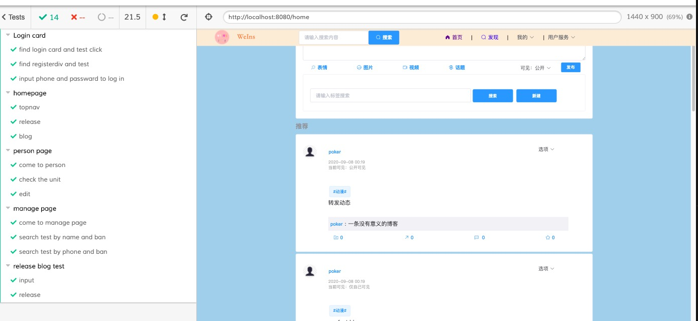

# functional and non-functional requirements

## functional requirements

* 用户
  * 注册登录
    * 用户使用唯一手机号和唯一用户名注册，实时查重。未满十四周岁不能注册。注册完成后选择兴趣标签。注册完成后默认为普通用户。
    * 登陆界面分流，管理员登陆使用专用通道。普通用户不能使用管理员入口登陆。
    * 管理员登陆之后界面有些许差异。
    * 被封禁用户不能登陆。
  * 管理员账户特殊权限
    * 可以进入用户管理界面，封禁和解封用户或者比自己权限低的用户。
    * 可以在用户管理界面通过昵称、号码等搜索用户，可查看所有用户状态
    * 可以删除他人帖子
    * 可以删除不良评论
  * 用户浏览动态
    * 登录之后有推荐动态，可以通过基础标签分类查看所有帖子。
    * 支持按照标签搜索动态、用户。
    * 可以在浏览界面转发博客、评论、点赞。
  * 用户互动
    * 支持模糊/精确搜索其他用户。
    * 支持关注/取消关注其他用户。
    * 通过点击头像进入其他用户的主页，可查看他人博客数、关注数等等信息。
  * 个人空间
    * 用户可以进入个人信息面板，查看自己所有博客、关注者、粉丝等等。
    * 用户可以修改个人信息，如性别昵称等，会查重。
    * 用户可以改变自己的头像，上传新头像。
* 动态
  * 发布动态
    * 支持附带图片，最多六张。可以添加表情、文字。
    * 支持附带标签，用户可以通过标签按钮添加或者搜索标签，最多添加两个。
    * 附加可见范围，如公开、粉丝可见、私密等等
  * 动态呈现
    * 动态卡片显示发布者头像姓名，可以点击进入主页。
    * 动态卡片显示发布时间、点赞数、评论数，有转发、评论按钮。
    * 动态实现分页加载，通过点击加载更多来加载动态
    * 动态图片可以通过点击来放大查看

## non-functional requirements

* 数据库结构和管理
  * Mysql数据库
    * blog表存储博客基本信息，如发布者、评论数、转发数、发布时间等等。
    * user表存储用户信息如权限、是否封禁、id、号码、密码等。
    * label表存储标签类容。
    * labelandblog表存储博客和标签对应信息。MongoDB
  * MongoDB数据库
    * blog表存储博客详细信息，如内容、转发者、评论者等等。
    * user表存储用户详细信息，如头像、粉丝、关注者等等。
* 测试
  * 前端
    * 前端单元测试：使用jest测试部分组件，平均覆盖率在90%左右
      
    * 前端端对端测试：使用cypress进行端对端测试，测试了包括注册、登陆、发博客、页面切换、修改个人信息等主要功能。
      
  * 后端
    * 单元测试：测试Service层、Controller层、Dao层，大致覆盖所有方法和类
      
      
      
      
* 日志观测
  * 生成用户运行日志，便于观测程序运行状态
* 性能测试和优化
  * 利用jemeter生成请求设置并发量为100，并借助Spring boot actuator和prometheus监测系统运行状态。测试目标为100并发量请求响应时间为2s以内。
  * 初始状态：
    * 。。
    * 。。
    * 。。
* 安全
  * 使用JWT,用户登录后生成一个token并随着login的response.data回馈给前端保存
  * 当前端发送需要身份认证的请求时取出token作为headers
