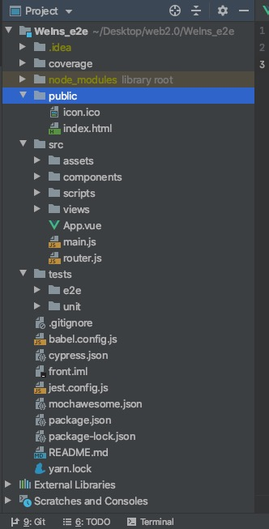
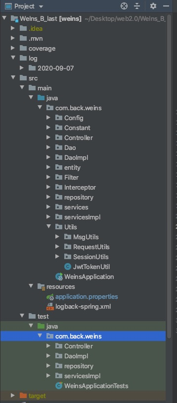

# architecture and design

## front-end

* 前端使用Vue框架，项目目录分层如下

  

* 目录说明
  * assets：存放全局样式表和图片目录
  * components：存放所有组件
  * view：存放页面文件
  * scripts：存储脚本文件
  * e2e：存放端对端测试文件
  * unit：存放前端单元测试文件

## back-end

* 后端采用Spring boot框架和MVC分层架构，链接Mysql和MangoDB数据库，项目目录如下

  
* 目录说明

  * entity：存放实体类表
  * Controller、Service、Dao：存放控制层、服务层和Dao层文件，Dao层负责数据拼装。
  * Config：存放配置文件
  * Constant：存放全局变量列表和常数列表
  * utils：存放工具类和JWT安全文件
  * Interceptor：存放session文件
  * Repostory:存放repostory类，对接数据库
  * test:存放测试文件
